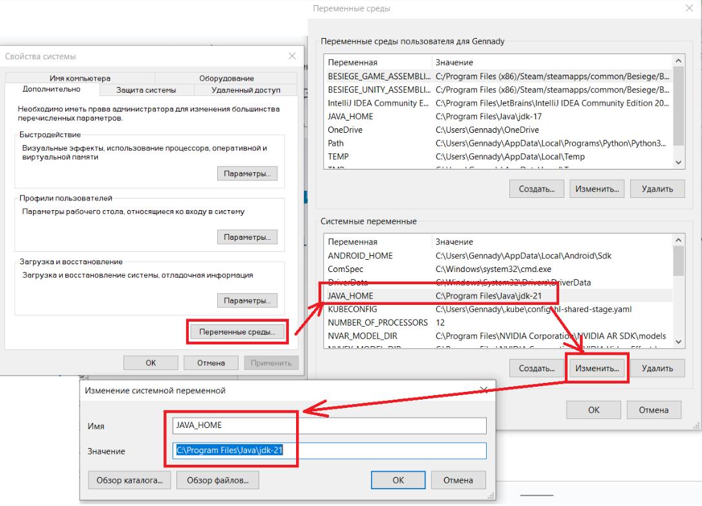

# Мобильное тестирование с Appium

## Введение в мобильное тестирование

Определение: Проверка функциональности, удобства использования и производительности мобильных приложений.

Цели: Обеспечение высокого качества мобильного ПО, выявление дефектов на ранних стадиях.

Типы тестирования:
- Функциональное тестирование
- Нефункциональное тестирование (производительность, безопасность)
- Юзабилити тестирование

## Проблемы мобильного тестирования

- Разнообразие устройств и ОС
- Различные разрешения экранов и размеры
- Ограниченные ресурсы (батарея, память)
- Работа в офлайн и онлайн режимах
- Множество сетевых условий

## Инструменты мобильного тестирования

- Appium: Открытый инструмент для кросс-платформенной автоматизации мобильных приложений, поддерживающий различные языки программирования.
- BrowserStack: Облачная платформа для тестирования мобильных приложений и веб-сайтов на реальных устройствах и эмуляторах.
- Sauce Labs: Облачная платформа для автоматизации тестирования с поддержкой множества мобильных устройств и браузеров.

## Инструменты мобильного тестирования

- XCUITest: Инструмент для автоматизации тестирования iOS приложений, встроенный в Xcode и обеспечивающий высокую производительность.
- Espresso: Инструмент для автоматизации тестирования Android приложений, разработанный Google и интегрированный с Android Studio.
- Perfecto: Облачная платформа для тестирования мобильных и веб-приложений на реальных устройствах и эмуляторах с расширенными возможностями отчетности.
- И другие…

## Что такое Appium?

### Инструмент для автоматизации мобильных приложений (iOS, Android).

Преимущества:
- Поддержка кросс-платформенности (один код для iOS и Android)
- Использование популярных языков программирования (Java, Python, etc.)
- Поддержка реальных устройств и эмуляторов/симуляторов

### Архитектура Appium

- Appium Server: Управляет автоматизацией и взаимодействует с устройством.
- Appium Client: Библиотеки для различных языков программирования.
- Appium Drivers: Специфичны для платформ (XCUITest для iOS, UiAutomator2 для Android).
- Appium Desktop: Графический пользовательский интерфейс для Appium, который позволяет запускать и управлять сервером Appium. На данный момент уже устарел.

## Установка и настройка Appium

### Шаги установки JDK + Android Studio

- Установить JDK и настроить переменные окружения JAVA_HOME и Path для bin: https://www.oracle.com/java/technologies/downloads/
- Установить Android Studio: https://developer.android.com/studio и переменные окружения ANDROID_HOME и Path: https://developer.android.com/tools/variables
- Настроить SDK Manager: Settings -> Android SDK
    - SDK Platforms: Android {version}
    - SDK Tools:
        - Android SDK Build Tools
        - Android Emulator
        - Android SDK Platform Tools
        - Android SDK Tools (Obsolete)
- Запустить виртуальное устройство или подключить свое собственное

### Пример переменных окружения



### Шаги установки xCode

- Иметь MacOS
- Установить xCode из AppStore
- Установить xCode Command line tools: sudo xcode-select --install
- Установить HomeBrew: https://brew.sh/
- Установить carthage: brew install carthage
- Установить iOS SDK для симуляторов в xCode

### Установка Appium

- Установить NodeJS: https://nodejs.org/en
- Установить Appium Server: https://appium.io/docs/en/latest/quickstart/install/
- Установить Appium Driver: https://appium.io/docs/en/latest/quickstart/uiauto2-driver/
- Установить Appium Client: https://github.com/appium/java-client#add-appium-java-client-to-your-test-framework
- Запустить Appium Server: 
```bash
appium
```

## Разработка мобильных тестов на Appium


### SessionId

SessionId — это уникальный идентификатор сессии, который создается сервером Appium при установке соединения с клиентом для выполнения теста.
Жизненный цикл SessionId:
- Создание: Генерируется при запуске новой сессии через клиентский запрос.
- Использование: Передается в каждом запросе клиента для идентификации сессии.
- Завершение: Удаляется после завершения сессии тестирования, освобождая ресурсы.

### Инициализация Appium драйвера

DesiredCapabilities — это набор ключей и значений, который используется для настройки и определения свойств сессии при автоматизации тестирования мобильных приложений.
- platformName: Указывает платформу устройства (например, "Android", "iOS").
- platformVersion: Версия операционной системы устройства (например, "10.0").
- deviceName: Имя или идентификатор устройства (например, "emulator-5554" для Android или "iPhone 12" для iOS).
- app: Путь к файлу приложения (.apk для Android или .app/.ipa для iOS).
- automationName: Используемый движок автоматизации (например, "UiAutomator2" для Android, "XCUITest" для iOS).
- udid: Уникальный идентификатор устройства, особенно полезен для реальных устройств.
- browserName: Имя браузера, если тестируется веб-приложение на мобильном устройстве (например, "Chrome", "Safari").
- noReset: Флаг, указывающий, следует ли сбрасывать состояние приложения между тестами (true/false).

### Запуск и остановка сессии (Android)
```java
DesiredCapabilities capabilities = new DesiredCapabilities();
capabilities.setCapability("platformName", "Android");
capabilities.setCapability("deviceName", "emulator-5554");
capabilities.setCapability("app", "/path/to/app.apk");

URL server = new URL("http://localhost:4723/wd/hub");
AppiumDriver driver = new AndroidDriver(server, capabilities);
driver.quit();
```

### Запуск и остановка сессии (iOS)
```java
DesiredCapabilities capabilities = new DesiredCapabilities();
capabilities.setCapability("platformName", "iOS");
capabilities.setCapability("platformVersion", "14.5");
capabilities.setCapability("deviceName", "iPhone 12");
capabilities.setCapability("app", "/path/to/app.app");
capabilities.setCapability("automationName", "XCUITest");
capabilities.setCapability("udid", "your_device_udid");
AppiumDriver<MobileElement> driver = new IOSDriver<>(url, capabilities);
```

### Appium локаторы

- By.id: Поиск по уникальному идентификатору элемента.
- By.className: Поиск по имени класса элемента.
- By.xpath: Поиск по XPath выражению.
- By.cssSelector: Поиск по CSS селектору (только для веб-приложений).
- By.name: Поиск по атрибуту name элемента.
- By.accessibilityId: Поиск по кросс платформенному идентификатору элемента.
- By.androidUIAutomator: Поиск с использованием UIAutomator для Android.
- By.iOSNsPredicateString: Поиск с использованием NSPredicate для iOS.

### Appium ожидания

- Неявные ожидания (Implicit Waits): Устанавливают общее время ожидания для всех элементов в тесте.
- Явные ожидания (Explicit Waits): Ждут определенное условие для конкретного элемента.
- Fluent Waits: Расширение явных ожиданий с возможностью настройки частоты проверки условий и игнорирования исключений.

```java
driver.manage().timeouts().implicitlyWait(10, TimeUnit.SECONDS);
```
```java
WebDriverWait wait = new WebDriverWait(driver, 20);
wait.until(ExpectedConditions.visibilityOfElementLocated(AppiumBy.id("id")));
```
```java
FluentWait<AndroidDriver> wait = new FluentWait<>(driver)
.withTimeout(Duration.ofSeconds(20))
.pollingEvery(Duration.ofSeconds(2))
.ignoring(NoSuchElementException.class);
wait.until((Function<WebDriver, WebElement>) driver -> driver.findElement(AppiumBy.id("id")));
```

### Appium действия

* click: Нажатие на элемент.
* sendKeys: Ввод текста в текстовое поле.
* clear: Очистка текста из текстового поля.
* getText: Извлечение текста из элемента.
* Проверка состояния: (Is Displayed, Is Enabled, Is Selected): Проверка видимости, доступности и состояния выбора элемента.

### Appium как посмотреть код?
```java
driver.getPageSource();
```
Appium Inspector: https://github.com/appium/appium-inspector 
```bash
appium --allow-cors
```


### Как запустить браузерные тесты
```bash
appium --allow-insecure chromedriver_autodownload
```

#### Полезные ссылки:
* https://appium.io/docs/en/latest/
* https://github.com/appium/appium